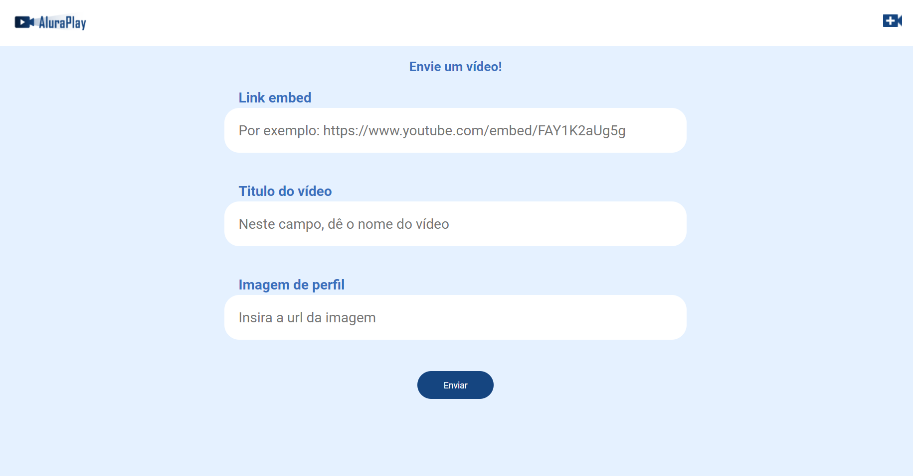

AluraPlay is a video sharing platform built by Fabio with help of Alura. It was made with HTML, CSS and the user interations are in JavaScript. This website is a kind of a "mini youtube", you can put and search videos. I wish you glad the result!

## Technologies used in the project
* HTML
* CSS
* Javascript
* NodeJS
* Json-server

## Screenshots
()
()
